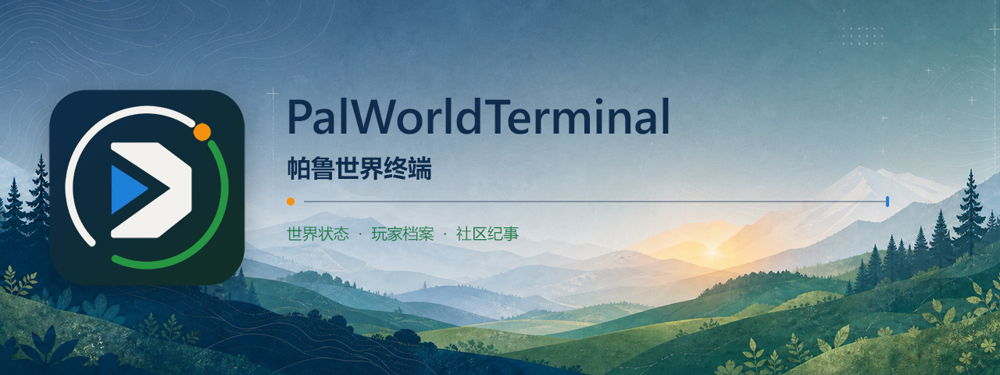
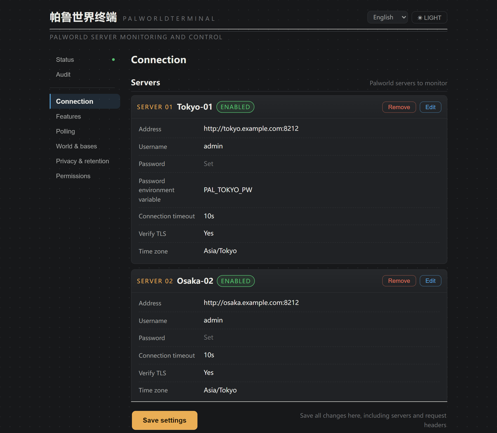
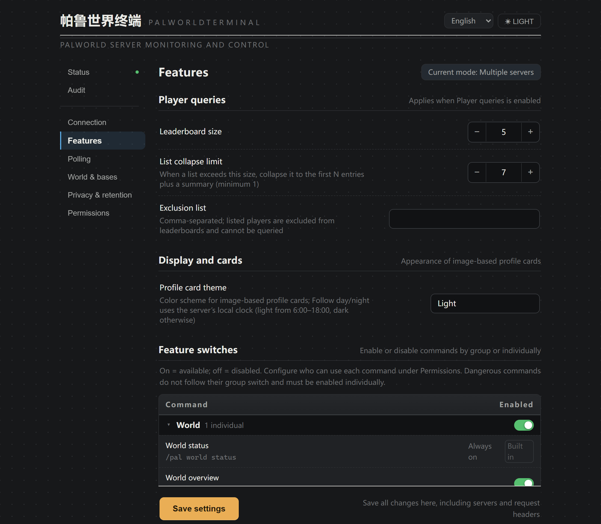
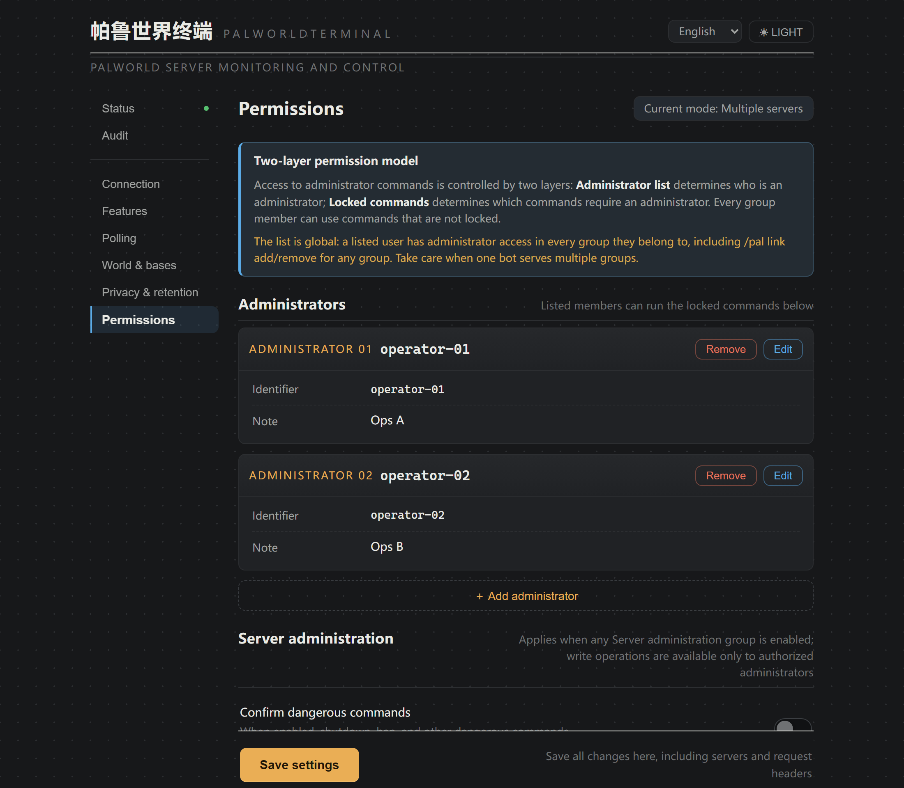
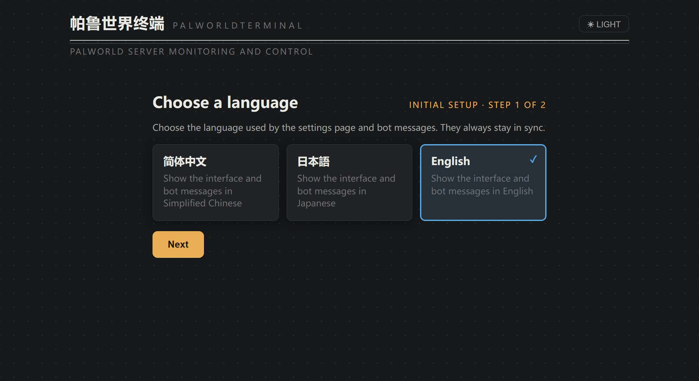
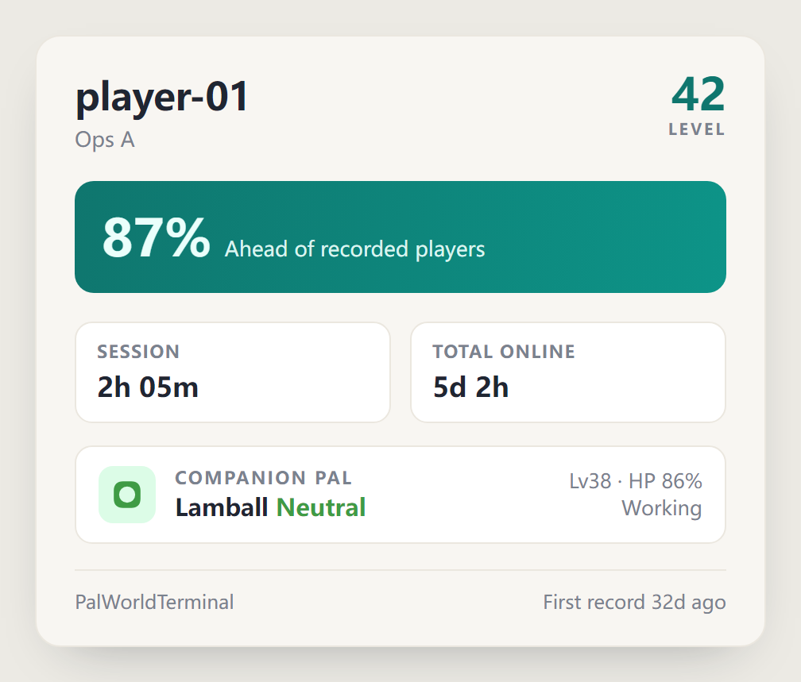
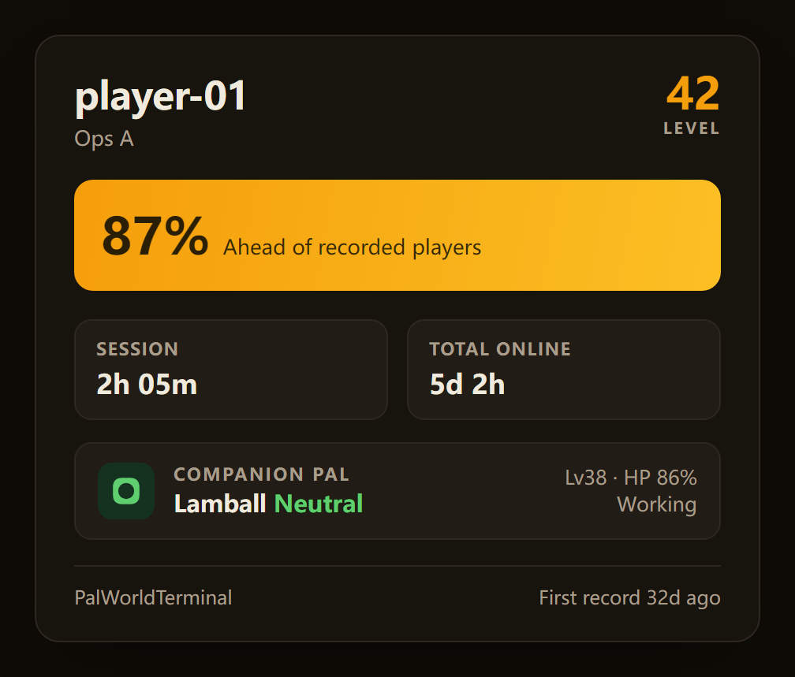

<div align="center">



<a id="readme"></a>
# PalWorldTerminal

[简体中文](README.md) | [日本語](README.ja.md) | **English**<br>
[](https://plugins.astrbot.app/)
[](https://github.com/SolitudeRA/astrbot_plugin_palworld/blob/main/metadata.yaml)
[](https://github.com/SolitudeRA/astrbot_plugin_palworld/actions/workflows/ci.yml)<br>
[](https://github.com/AstrBotDevs/AstrBot)
[](https://docs.palworldgame.com/category/rest-api/)
[](https://github.com/SolitudeRA/astrbot_plugin_palworld/blob/main/LICENSE)<br>
**Manage one or many Palworld servers from AstrBot, while letting group members take part through live status,
daily reports, events, and rankings.**

For operators: visual settings · separate feature and permission controls · per-group multi-server access ·
confirmation for dangerous actions<br>
For groups: world status · daily reports · event history · base activity and Paldeck · profile cards and rankings

[See the actual UI](#actual-ui) · [Quick start](#quick-start) · [Command reference](docs/commands.en.md) ·
[Report an issue](https://github.com/SolitudeRA/astrbot_plugin_palworld/issues)

Read-only collection · controlled writes disabled by default · server administration restricted to authorized admins<br>
The observation database stores no IP addresses · group replies reveal no precise locations — see
[Security boundaries](#security-boundaries)

</div>

---

<a id="actual-ui"></a>
## Actual UI

The screenshots below come from the real plugin settings page using built-in demo data. Server addresses, accounts,
and status values are examples.

<a id="settings-dashboard"></a>
### Daily operations in one settings page

Server connections, runtime snapshots, feature switches, polling intervals, privacy retention, administrators,
command permissions, and administration records all live on one page. Passwords can come from environment variables
and are never echoed by the page. Saving validates the configuration first, then reloads the plugin automatically.

<p align="center">
  
</p>

<a id="features-and-permissions"></a>
### Configure availability separately from access

Every configurable command has separate controls for whether it is enabled and whether it is admin-only. Apply a
setting to a command group first, then override individual commands when needed. Group-chat server administration,
`link add/remove`, and `/pal confirm` always require a plugin administrator. Bans, scheduled shutdowns, and forced
stops never inherit enablement from the server administration group; each must be enabled explicitly.

**Feature switches decide which commands are available**

<p align="center">
  
</p>

**Administrator permissions decide who may use enabled commands**

<p align="center">
  
</p>

<a id="single-and-multi-world"></a>
### Keep one server simple, or manage many per group

Choose single-server or multi-server mode during initial setup. Single-server mode fixes commands that need a target
to the first ready server, so users never need to choose one. Multi-server mode can connect several servers, grant a
different scope to each group, and let query commands select a server explicitly with `@server-name`. When switching
modes later, the wizard previews the effect and can migrate group grants. When switching to single-server mode, it
also lets you choose the server to keep and whether to remove all data belonging to the others.

<p align="center">
  
</p>

<a id="chat-examples"></a>
## What it looks like in chat

After initial setup and chat authorization, members can view world status, server rules, online players, today's
report, and event history. They can also check base activity and browse the server Paldeck. Operators decide whether
player profiles and rankings are available. Everything is requested on demand, so the plugin does not flood the
chat, while world progress, online records, and player growth naturally become shared topics. `/pal help` lists only
the commands actually available for the current mode, feature settings, and caller.

```text
🌍 World Status · Palpagos
Day 42 · v1.1.0 · Uptime 6d 9h

Online 2/32 · Today's peak 7
Performance 🟢 Smooth · FPS 58 · Frame time 17.2ms

Online players
· Neo Lv21
· Trinity Lv18
```

Daily life in Palworld can become part of the conversation too. Base details summarize the currently visible Pals'
activity mix and idle rate, while the Paldeck records species ever observed on the server. When player profiles are
enabled, members can show their own profile card; `card`/`卡` renders an image, using the light or dark theme selected
by the operator.

```text
> /pal guild base Main Base
🏕️ Base · Main Base
Guild "Vanguard" · High confidence
🔥 Full Steam Ahead · The Pals are giving it everything!

Visible now 12 · Active 9 · Average Lv23.4
Status 🟢 Healthy · Average HP 88%
🚬 Idle rate 17%

Activity distribution
· ⛏5 Working · 🚶2 Moving · 🚬2 Idle · 🛌2 Sleeping

Popular species (currently visible for this guild)
· Azurobe ×4 · Chikipi ×3
└ Bases are inferred from plugin observations · Only Pals visible now are counted

> /pal me
🎴 My Profile · Neo
Lv34 · 🟢 Online · Current session 2h 14m

Ahead of 87% of recorded players
Today 2h 14m · Total 1d 22h
Guild "Vanguard"
Companion Jetragon (Dragon) Lv50 · HP 92% · Following
```

<p align="center">
  
  
</p>

When enabled by the operator, plugin administrators can broadcast, save, moderate players, or schedule a shutdown
from chat. These commands are disabled by default and use the official REST API when enabled. Dangerous operations
such as shutdown can also require confirmation.

```text
> /pal server shutdown 60 Server maintenance
⚠️ Confirmation required · Shutdown (60-second countdown) · Main Server
└ Send /pal confirm within 30 seconds to proceed; otherwise it expires

> /pal confirm
✅ Confirmed · Shutdown (60-second countdown) · Main Server
```

<a id="capabilities"></a>
## Capabilities and defaults

| Capability | Default | Description |
|---|---:|---|
| World observation | On | World status, rules, online list, and role-aware help; initial setup and session authorization are still required |
| Reports and events | On | Reports are generated on request; events are recorded during polling; neither is pushed automatically |
| Player profiles | **Off** | Player lookup, linking, rankings, and profile cards are operator-controlled; cards can be rendered as images |
| Basic administration | **Off** | Broadcast, save, kick, and unban; always restricted to plugin administrators |
| Dangerous administration | **Off** | Ban, scheduled shutdown, and forced stop must be enabled individually; optional confirmation is available |
| Guilds and bases | **On** | Guilds, bases, world overview, and Paldeck derived from `game-data` (PalGameDataBridge); enabled by default with game-data support |

> **Guilds and bases are enabled by default:** guilds, bases, `world overview`, and the Paldeck use data derived from
> Palworld's official [`/game-data`](https://docs.palworldgame.com/api/rest-api/game-data/) endpoint
> (PalGameDataBridge). Now that the API is stable, the plugin enables these features and polls `/game-data` by
> default. If you do not need them, disable the corresponding commands in the Features section of the settings page.
> Player profiles remain disabled by default.

<a id="quick-start"></a>
## Quick start

<a id="requirements"></a>
### Requirements

| Item | Requirement |
|---|---|
| AstrBot | **≥ 4.24.1 and < 5** |
| Python | **≥ 3.11**; CI covers 3.11, 3.12, and 3.13 |
| Palworld | Dedicated server with the 1.0 REST API; verify REST connectivity in your own deployment before production use |
| Data directory | AstrBot's data directory must be writable and persistent; no separate database service is required |

<a id="enable-rest-api"></a>
### 1. Enable the Palworld REST API

Open the effective `Pal/Saved/Config/WindowsServer/PalWorldSettings.ini` or
`LinuxServer/PalWorldSettings.ini`. Set a strong `AdminPassword`, `RESTAPIEnabled=True`, and `RESTAPIPort=8212`
(change the port if your deployment requires it), then restart PalServer. `DefaultPalWorldSettings.ini` is only a
template; editing it has no effect.

From the host or container running AstrBot, verify access with:

```bash
curl -u admin http://PALWORLD_HOST:8212/v1/api/info
```

Enter the `AdminPassword`; the command should return server information. `8212/TCP` is the REST port, not the
`8211/UDP` game port. Never expose the REST API directly to the public internet. Keep it behind a trusted LAN,
private container network, VPN, or protected reverse proxy.

<a id="install-plugin"></a>
### 2. Install the plugin

Open the plugin market in AstrBot WebUI, search for `PalWorldTerminal`, and install it. You can also use the WebUI's
URL or local-file installation options. AstrBot normally installs the required dependencies automatically.

<a id="configure-servers"></a>
### 3. Choose a mode and add servers

Open PalWorldTerminal Settings, choose single-server or multi-server mode, then enter a `base_url` reachable from
AstrBot, a username, and the Palworld `AdminPassword`. Do not use `ServerPassword`. The address must stop at the port
and must not include `/v1/api`. Until the mode is confirmed, the initial-setup gate blocks every command except
`/pal help`, `/pal whoami`, and `/pal whereami`.

For production, prefer `password_env` to reference an environment variable injected into the AstrBot process or
container. Restart the entire AstrBot process after changing the variable.

> If AstrBot runs in Docker, `127.0.0.1` points to the AstrBot container, not PalServer. For cross-container access,
> use a service name on the same private network, the host gateway, or a LAN address. Set the timezone to the
> server's location; for example, a server in mainland China should normally change the default `Asia/Tokyo` to
> `Asia/Shanghai`.

<a id="authorize-admins"></a>
### 4. Complete security authorization

New installations use restricted access (`access_mode=restricted`). Until a chat is added to the allowlist, it
cannot query the server. This is the intended safe state, not an installation failure.

- **Single-server mode:** send `/pal whereami` in the target group, then add the returned UMO to Connections →
  Allowed groups.
- **Multi-server mode:** send `/pal whoami`, add the returned `platform:account` to the plugin administrator list,
  then run `/pal link add <server-name>` in the target group.

Plugin administrators are managed separately from AstrBot's global administrators. To administer a server, also
enable the required commands individually on the Features page.

<a id="verify-installation"></a>
### 5. Verify

First confirm that the settings page shows a runtime snapshot for the server. Then run these commands in an
authorized chat:

```text
/pal world status
/pal online
```

Guild and base features are enabled by default, so you can also validate `/pal guild list` and `/pal dex`. Disable
them in the Features section if you do not need them.

<a id="common-commands"></a>
## Common commands

| Command | Default | Purpose |
|---|---:|---|
| `/pal help` | On | Generate role-aware help for the current mode and feature settings |
| `/pal world status` | On | World status, online count, FPS, and world day |
| `/pal online` | On | Current online players |
| `/pal world today` | On | Generate today's report and online statistics on demand |
| `/pal world events` | On | World-day milestones, online records, new players, and level-up events |
| `/pal guild base <名称\|#序号>` | On | Live base activity: behavior mix, idle rate, and atmosphere badge |
| `/pal dex` | On | Server Paldeck: observed species grouped by element |
| `/pal rank [today\|total\|level\|climb]` | Off | Today's/total online-time rankings, level ranking, and seven-day climb ranking |
| `/pal me [hide\|show\|card\|卡\|图]` | Off | Personal profile with level, guild, percentile, and companion highlight; `card`/`卡`/`图` renders an image |
| `/pal server ...` | Off | Broadcast, save, player moderation, and shutdown administration |

In multi-server mode, use `/pal link list/add/remove` to manage the current group's server access. Query commands can
append `@<server-name>`, for example `/pal world status @alpha`. Administration commands use the group's current
active server; switch the target before running them. See the
[complete command reference](docs/commands.en.md) for parameters, disabled behavior, and the permission matrix.

<a id="security-boundaries"></a>
## Security boundaries

- **Enable REST, but do not expose it publicly:** Palworld REST API uses Basic Auth and must not be exposed directly
  to the public internet. Prefer a private network, VPN, or protected gateway.
- **Controlled writes and audit:** every server administration command is disabled by default and always requires a
  plugin administrator. When audit storage is healthy, administration requests that reach the execution stage record
  success or failure. Requests rejected during permission, argument, or server-selection checks are not audited.
- **Prefer environment variables for sensitive credentials:** with `password_env` / `value_env`, sensitive values
  are not written to plugin configuration or echoed in the settings page. Passwords or Header values entered directly
  are still stored in AstrBot configuration and backups.
- **Minimize stored player data:** the observation database stores no connection IP, raw `userId/playerId`, account
  name, or raw ping. Player identifiers use a world-scoped HMAC. The current version does not collect positions
  derived from `/game-data`, and chat replies never expose precise coordinates.
- **Save before stopping:** `server stop` stops the server immediately without saving the world. Run
  `/pal server save` before important operations and consider requiring confirmation for dangerous commands.
- **Retention settings are not enforced automatically yet:** history and audit retention days are configurable, but
  scheduled expiry is not implemented in the current version. Manage the AstrBot data directory according to your
  operational and compliance needs; do not treat these settings as an automatic-deletion guarantee.

For more about connections, group authorization, polling, credentials, privacy, and mode conversion, see the
[configuration reference](docs/configuration.en.md).

<a id="faq"></a>
## FAQ

| Symptom | Check first |
|---|---|
| "Initial setup is incomplete" | Open the plugin settings page, choose single-server or multi-server mode, and confirm |
| "Unauthorized" | In single-server mode check Allowed groups; in multi-server mode check plugin administrators and `/pal link add` |
| `401 Unauthorized` | Check whether `ServerPassword` was used instead of `AdminPassword`, or whether the environment variable was not injected into the AstrBot process |
| Timeout / connection refused | Check that REST is enabled and PalServer restarted, `8212/TCP`, the firewall, container networking, and `base_url` |
| "No available server" | Check that the server is enabled and its address and password are complete; configuration readiness does not guarantee network reachability |
| Guild / base data is empty | Guilds and bases (`guilds_bases`) are on by default and poll `/game-data`; verify that the server exposes a reachable game-data API and that the group was not disabled manually |

<a id="docs-and-contributing"></a>
## Documentation and contributing

- [Configuration reference](docs/configuration.en.md) — servers, routing, permissions, polling, privacy, credentials,
  and the settings page
- [Complete command reference](docs/commands.en.md) — command tree, arguments, defaults, routing, and fallback behavior
- [Contributing guide](CONTRIBUTING.en.md) — development setup, tests, frontend builds, and commit conventions
- [Issue tracker](https://github.com/SolitudeRA/astrbot_plugin_palworld/issues) — include the version, operating mode,
  and redacted logs; never submit passwords, tokens, or complete user identifiers

CI runs Ruff, mypy, the Python test matrix, and frontend tests and build checks. Runtime dependencies are limited to
`aiohttp`, `aiosqlite`, and `tzdata`; the development environment uses `requirements-dev.txt`, and end users do not
need Node/npm.

<a id="license"></a>
## License

This project is licensed under [GPL-3.0](https://github.com/SolitudeRA/astrbot_plugin_palworld/blob/main/LICENSE).
