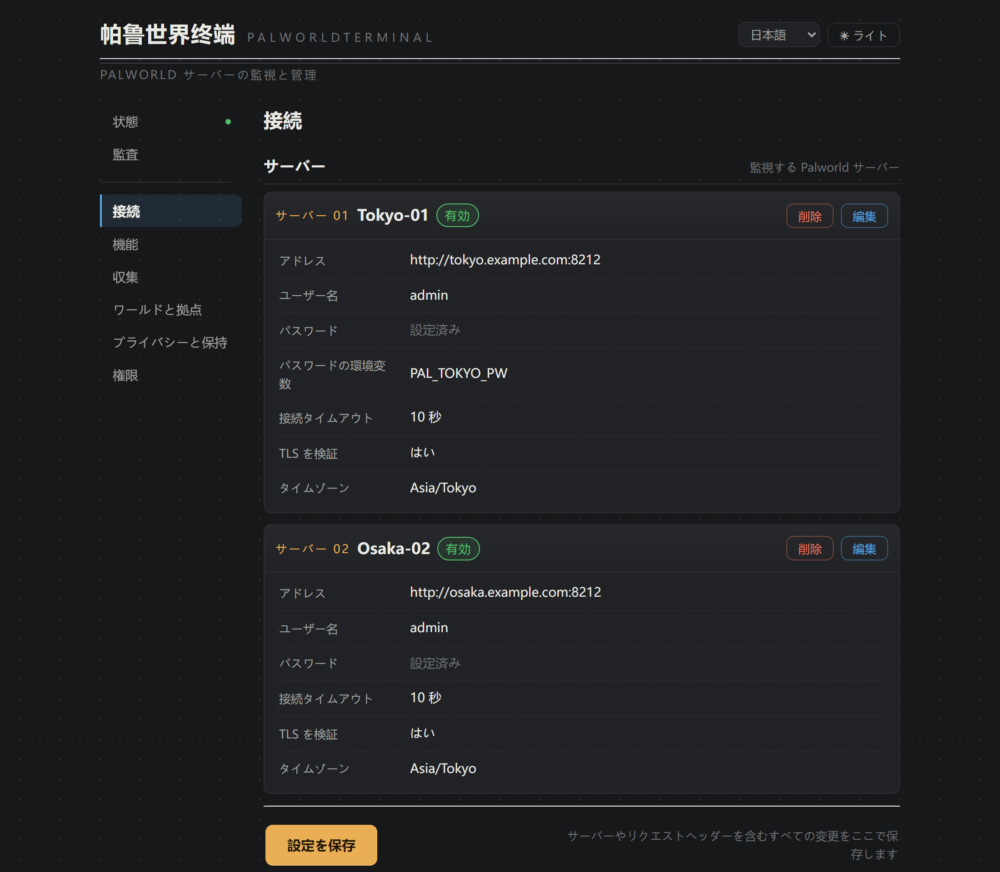
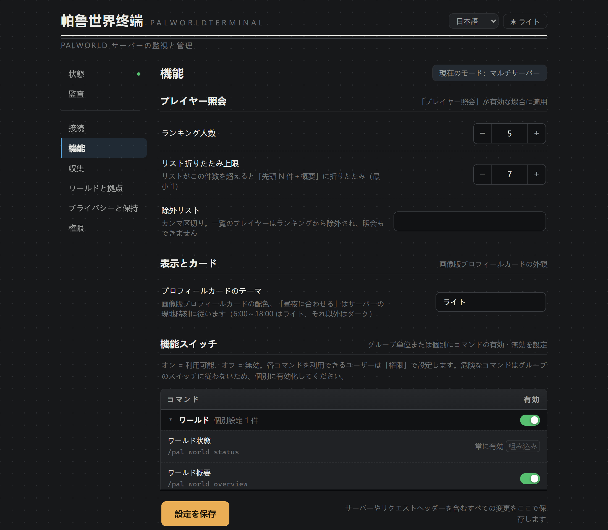
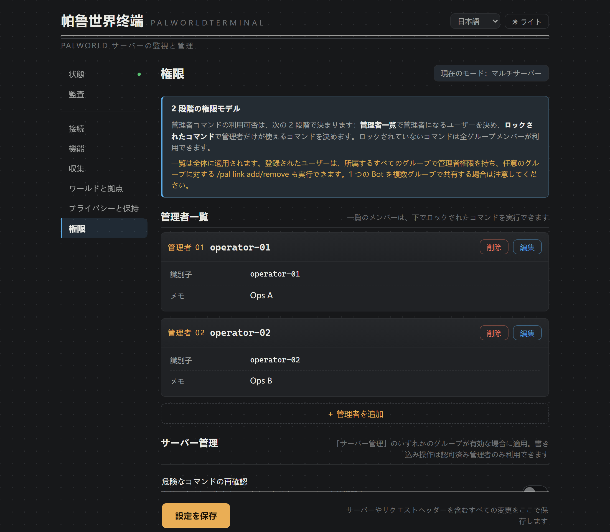
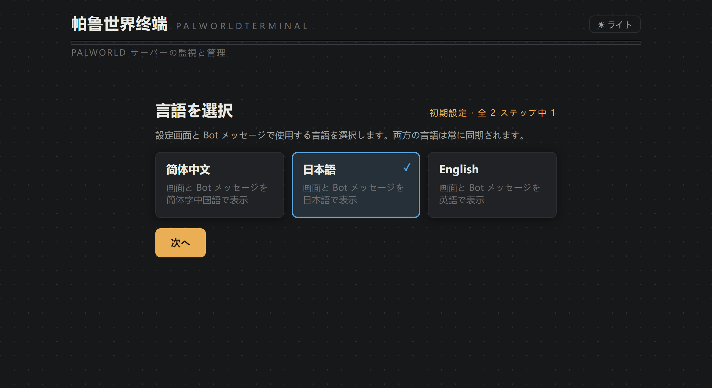
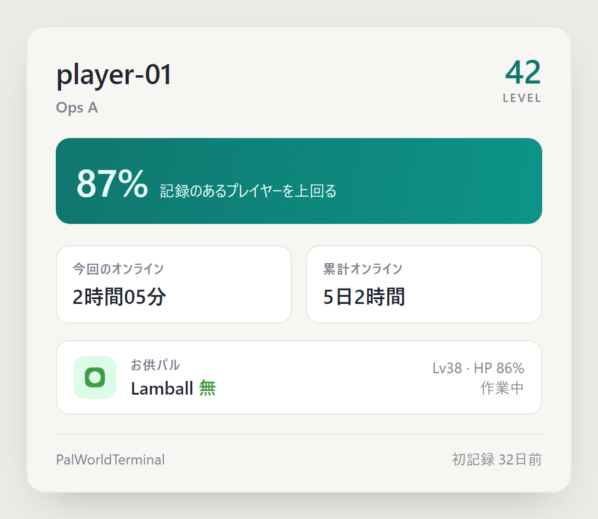
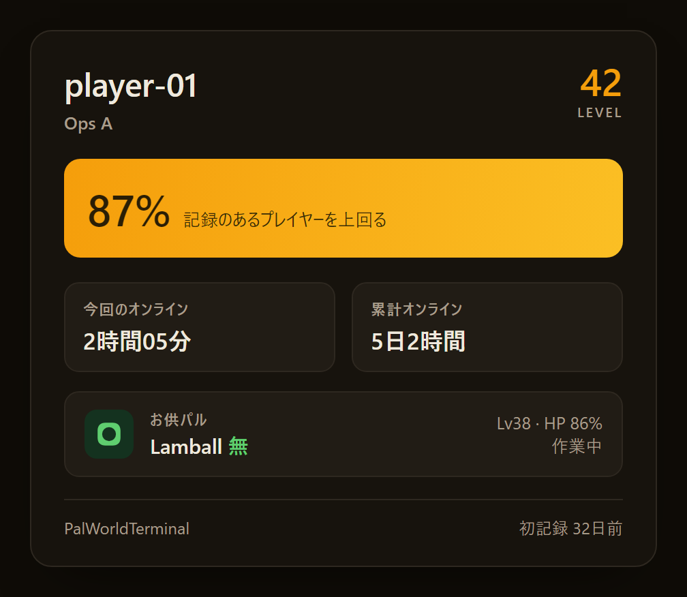

<div align="center">


<a id="readme"></a>
# PalWorldTerminal

[简体中文](README.md) | **日本語** | [English](README.en.md)<br>
[](https://plugins.astrbot.app/)
[](https://github.com/SolitudeRA/astrbot_plugin_palworld/blob/main/metadata.yaml)
[](https://github.com/SolitudeRA/astrbot_plugin_palworld/actions/workflows/ci.yml)<br>
[](https://github.com/AstrBotDevs/AstrBot)
[](https://docs.palworldgame.com/category/rest-api/)
[](https://github.com/SolitudeRA/astrbot_plugin_palworld/blob/main/LICENSE)<br>
**AstrBot から Palworld の単一サーバーまたは複数サーバーを一元管理し、ステータス、日報、イベント、
ランキングを通じてグループのメンバーも日々の運営に参加できるプラグインです。**

運営者向け：視覚的な設定 · 機能と権限の分離 · グループごとの複数サーバー認可 · 危険な操作の再確認<br>
グループ向け：ワールド状況 · 日報 · イベント履歴 · 拠点の稼働状況とパル図鑑 · プロフィールカードとランキング

[実際の画面](#actual-ui) · [クイックスタート](#quick-start) · [コマンド一覧](docs/commands.ja.md) ·
[不具合を報告](https://github.com/SolitudeRA/astrbot_plugin_palworld/issues)

収集は読み取り専用 · 制御された書き込みは初期状態で無効 · サーバー操作は認可済み管理者のみ<br>
観測データベースに IP アドレスを保存しません · グループに正確な位置を公開しません —
[セキュリティ境界](#security-boundaries)を参照してください

</div>

---

<a id="actual-ui"></a>
## 実際の画面

以下は、組み込みのデモデータを使用した実際のプラグイン設定画面です。サーバーのアドレス、
アカウント、稼働状況は例です。

<a id="settings-dashboard"></a>
### 日常運用を一つの画面に集約

サーバー接続、稼働スナップショット、機能スイッチ、ポーリング間隔、プライバシーと保持期間、
管理者、コマンド権限、操作記録を一つの画面で扱えます。パスワードは環境変数から渡すことができ、
画面に秘密値は再表示されません。保存時は構成を検証し、成功するとプラグインを自動的に再読み込みします。

<p align="center">
  
</p>

<a id="features-and-permissions"></a>
### 機能の公開と利用者を別々に制御

各コマンドについて、有効かどうかと管理者限定かどうかを別々に設定できます。まずコマンドグループに
まとめて適用し、必要なコマンドだけ個別に上書きできます。グループチャットからのサーバー操作、
`link add/remove`、`/pal confirm` は常にプラグイン管理者だけが実行できます。BAN、カウントダウン停止、
強制停止はサーバー操作グループから有効状態を継承せず、それぞれ明示的に有効化する必要があります。

**機能スイッチ：利用できるコマンドを決定**

<p align="center">
  
</p>

**管理者権限：有効なコマンドを誰が使えるか決定**

<p align="center">
  
</p>

<a id="single-and-multi-world"></a>
### 1 台ならシンプルに、複数ならグループごとに管理

初回構成で単一サーバーモードまたは複数サーバーモードを選びます。単一サーバーモードでは、
対象が必要なコマンドを最初の準備済みサーバーに固定するため、利用者が選択する必要はありません。
複数サーバーモードでは複数台へ接続し、グループごとに利用範囲を割り当て、クエリの末尾に
`@サーバー名` を付けて明示的に選択できます。後からモードを変更する場合、ウィザードが影響を
事前表示し、グループ認可を移行できます。単一サーバーモードへ切り替える際は、残すサーバーと、
ほかのサーバーのデータを削除するかどうかも選べます。

<p align="center">
  
</p>

<a id="chat-examples"></a>
## チャットでの表示例

初回構成とチャットの認可を終えると、メンバーはワールド状況、サーバールール、オンラインプレイヤー、
本日の日報、イベント履歴を確認できます。拠点の稼働状況やサーバーのパル図鑑も参照できます。
プレイヤー情報とランキングを公開するかどうかは運営者が決めます。情報は必要なときだけ取得するため、
自動投稿でチャットを埋めることなく、ワールドの進行、オンライン記録、成長を共通の話題にできます。
`/pal help` は現在のモード、機能、有効な権限に合わせて実際に使えるコマンドだけを表示します。

```text
🌍 ワールド状況 · Palpagos
42 日目 · v1.1.0 · 稼働 6日9時間

オンライン 2/32 · 本日のピーク 7
パフォーマンス 🟢 快適 · FPS 58 · フレーム時間 17.2ms

オンラインプレイヤー
· Neo Lv21
· Trinity Lv18
```

Palworld の日常もグループの話題になります。拠点詳細は現在見えているパルの行動分布や休憩率をまとめ、
パル図鑑はサーバーで観測された種族を記録します。プレイヤー情報を有効にすると、自分のプロフィールを
表示でき、`card`／`卡` で画像版を生成できます。配色は運営者がライトまたはダークから選びます。

```text
> /pal guild base メイン拠点
🏕️ 拠点 · メイン拠点
ギルド「ヴァンガード」 · 信頼度：高
🔥 フル稼働 · パルたちは全力で働いています！

現在表示 12 体 · 活動中 9 · 平均 Lv23.4
状態 🟢 良好 · 平均 HP 88%
🚬 休憩率 17%

行動分布
· ⛏5 作業中 · 🚶2 移動中 · 🚬2 休憩中 · 🛌2 睡眠中

人気種族（このギルドで現在表示中）
· アズレーン ×4 · モコロン ×3
└ 拠点はプラグインの観測から推定 · 現在表示されているパルだけを集計

> /pal me
🎴 マイプロフィール · Neo
Lv34 · 🟢 オンライン · 今回 2時間14分

記録済みプレイヤーの 87% を上回ります
本日 2時間14分 · 累計 1日22時間
ギルド「ヴァンガード」
同行 ジェッドラン（竜）Lv50 · HP 92% · 随行中
```

<p align="center">
  
  
</p>

運営者が必要な機能を有効にすると、プラグイン管理者はチャットから一斉通知、セーブ、
プレイヤー対応、停止予約を実行できます。これらは初期状態で無効であり、有効化後は公式 REST API
を利用します。停止などの危険な操作には再確認を要求することもできます。

```text
> /pal server shutdown 60 サーバーメンテナンス
⚠️ 確認待ち · 停止（60 秒カウントダウン） · メインサーバー
└ 30 秒以内に /pal confirm を送信すると実行し、時間切れで破棄されます

> /pal confirm
✅ 確認して実行 · 停止（60 秒カウントダウン） · メインサーバー
```

<a id="capabilities"></a>
## 機能と初期状態

| 機能 | 初期状態 | 説明 |
|---|---:|---|
| ワールド観測 | 有効 | ワールド状況、ルール、オンライン一覧、権限別ヘルプ。初回構成とセッション認可は必要です |
| 日報とイベント | 有効 | 日報は要求時に生成し、イベントはポーリング時に記録します。どちらも自動投稿しません |
| プレイヤー情報 | **無効** | プレイヤー検索、連携、ランキング、プロフィールカードを運営者が必要に応じて公開します。カードは画像でも生成できます |
| 基本操作 | **無効** | 一斉通知、セーブ、キック、BAN 解除。常にプラグイン管理者だけが利用できます |
| 危険な操作 | **無効** | BAN、カウントダウン停止、強制停止は個別に有効化します。再確認も利用できます |
| ギルドと拠点 | **有効** | `game-data`（PalGameDataBridge）から導出したギルド、拠点、ワールド概要、パル図鑑。game-data の安定提供に合わせて初期状態で有効です |

> **ギルドと拠点は初期状態で有効です：** ギルド、拠点、`world overview`、パル図鑑は Palworld 公式の
> [`/game-data`](https://docs.palworldgame.com/api/rest-api/game-data/)（PalGameDataBridge）から導出します。
> API の安定提供に伴い、このプラグインは初期状態で機能を有効にし、`/game-data` をポーリングします。
> 不要な場合は設定画面の「機能」で対応するコマンドを無効にしてください。プレイヤー情報は引き続き
> 初期状態で無効です。

<a id="quick-start"></a>
## クイックスタート

<a id="requirements"></a>
### 動作要件

| 項目 | 要件 |
|---|---|
| AstrBot | **4.24.1 以上、5 未満** |
| Python | **3.11 以上**。CI は 3.11、3.12、3.13 を対象とします |
| Palworld | 専用サーバーの 1.0 REST API に対応。本番利用前に自身の環境で REST 接続を確認してください |
| データディレクトリ | AstrBot のデータディレクトリが書き込み可能かつ永続化済みであること。別のデータベースサービスは不要です |

<a id="enable-rest-api"></a>
### 1. Palworld REST API を有効にする

実際に読み込まれる `Pal/Saved/Config/WindowsServer/PalWorldSettings.ini` または
`LinuxServer/PalWorldSettings.ini` を開きます。強力な `AdminPassword`、`RESTAPIEnabled=True`、
`RESTAPIPort=8212` を設定し、必要なら環境に合わせてポートを変更してから PalServer を再起動します。
`DefaultPalWorldSettings.ini` はテンプレートにすぎず、編集しても反映されません。

AstrBot を実行するホストまたはコンテナから次を実行して、接続を確認します。

```bash
curl -u admin http://PALWORLD_HOST:8212/v1/api/info
```

`AdminPassword` を入力するとサーバー情報が返るはずです。`8212/TCP` は REST 用ポートであり、
ゲーム用の `8211/UDP` ではありません。REST API をインターネットへ直接公開しないでください。
信頼できる LAN、プライベートなコンテナネットワーク、VPN、または保護されたリバースプロキシの内側に配置します。

<a id="install-plugin"></a>
### 2. プラグインをインストールする

AstrBot WebUI のプラグインマーケットで `PalWorldTerminal` を検索してインストールします。
WebUI の URL またはローカルファイルからのインストールも利用できます。通常、必要な依存関係は
AstrBot が自動的に処理します。

<a id="configure-servers"></a>
### 3. モードを選びサーバーを追加する

PalWorldTerminal の設定を開き、単一サーバーまたは複数サーバーを選択します。AstrBot から到達できる
`base_url`、ユーザー名、Palworld の `AdminPassword` を入力し、`ServerPassword` と取り違えないでください。
アドレスはポートまでにし、`/v1/api` を付けません。モードを確定するまで、初回構成ゲートは
`/pal help`、`/pal whoami`、`/pal whereami` 以外のコマンドを遮断します。

本番環境では `password_env` で AstrBot のプロセスまたはコンテナに注入した環境変数を参照する方法を
推奨します。変数を変更した後は AstrBot プロセス全体を再起動してください。

> AstrBot が Docker 内で動く場合、`127.0.0.1` は PalServer ではなく AstrBot コンテナ自身を指します。
> コンテナ間では、同じプライベートネットワーク上のサービス名、ホストゲートウェイ、または LAN
> アドレスを使ってください。タイムゾーンはサーバー所在地に合わせます。たとえば中国本土のサーバーでは、
> 初期値の `Asia/Tokyo` を通常 `Asia/Shanghai` に変更します。

<a id="authorize-admins"></a>
### 4. セキュリティ認可を完了する

新規インストールは制限付きアクセス（`access_mode=restricted`）を使用します。チャットを許可リストへ
追加するまではサーバーを照会できません。これは安全な初期状態であり、インストール失敗ではありません。

- **単一サーバー：** 対象グループで `/pal whereami` を送信し、返された UMO を「接続 → 許可グループ」
  に追加します。
- **複数サーバー：** `/pal whoami` を送信し、返された `platform:account` をプラグイン管理者へ追加してから、
  対象グループで `/pal link add <サーバー名>` を実行します。

プラグイン管理者は AstrBot のグローバル管理者とは別に管理されます。サーバーを操作する場合は、
必要なコマンドも「機能」で個別に有効化してください。

<a id="verify-installation"></a>
### 5. 動作確認

まず設定画面にサーバーの稼働スナップショットが表示されることを確認し、認可済みのチャットで
次を実行します。

```text
/pal world status
/pal online
```

ギルドと拠点は初期状態で有効なので、`/pal guild list` と `/pal dex` も確認できます。不要なら
設定画面の「機能」で無効にしてください。

<a id="common-commands"></a>
## よく使うコマンド

| コマンド | 初期状態 | 用途 |
|---|---:|---|
| `/pal help` | 有効 | 現在のモード、機能、権限に応じたヘルプ |
| `/pal world status` | 有効 | ワールド状況、オンライン人数、FPS、ワールド日数 |
| `/pal online` | 有効 | 現在のオンラインプレイヤー |
| `/pal world today` | 有効 | 本日の日報とオンライン統計を要求時に生成 |
| `/pal world events` | 有効 | ワールド日数の節目、オンライン記録、新規プレイヤー、レベルアップ |
| `/pal guild base <名称\|#序号>` | 有効 | 拠点の行動分布、休憩率、雰囲気バッジ |
| `/pal dex` | 有効 | 観測済み種族を属性別にまとめたサーバーのパル図鑑 |
| `/pal rank [today\|total\|level\|climb]` | 無効 | 本日・累計オンライン時間、レベル、直近 7 日間の上昇ランキング |
| `/pal me [hide\|show\|card\|卡\|图]` | 無効 | レベル、ギルド、パーセンタイル、同行パルを含むプロフィール。`card`/`卡`/`图` は画像版を生成 |
| `/pal server ...` | 無効 | 一斉通知、セーブ、プレイヤー対応、サーバー停止 |

複数サーバーモードでは `/pal link list/add/remove` で現在のグループの認可を管理します。
クエリ末尾には `/pal world status @alpha` のように `@<サーバー名>` を追加できます。操作コマンドは
グループの現在のアクティブサーバーを使用するため、先に対象を切り替えてください。引数、無効時の動作、
権限表は[コマンド一覧](docs/commands.ja.md)を参照してください。

<a id="security-boundaries"></a>
## セキュリティ境界

- **REST は有効にしても公開しない：** Palworld REST API は Basic Auth を使用するため、インターネットへ
  直接公開しません。プライベートネットワーク、VPN、または保護されたゲートウェイを優先してください。
- **制御された書き込みと監査：** サーバー操作コマンドはすべて初期状態で無効で、常にプラグイン管理者を
  要求します。監査ストレージが正常なら、実行段階に到達した操作要求は成功または失敗を記録します。
  権限、引数、サーバー選択で拒否された要求は監査に記録されません。
- **秘密情報には環境変数を優先：** `password_env` / `value_env` を使うと、秘密値はプラグイン構成へ
  書き込まれず、設定画面にも再表示されません。直接入力したパスワードや Header 値は AstrBot の
  構成ファイルとバックアップに保存されます。
- **プレイヤーデータを最小化：** 観測データベースは接続 IP、未加工の `userId/playerId`、
  アカウント名、未加工の Ping を保存しません。プレイヤー識別子にはワールド単位の HMAC を使います。
  現行版は `/game-data` 由来の位置を収集せず、チャット応答も正確な座標を公開しません。
- **停止前に保存：** `server stop` はワールドを保存せず即時停止します。重要な操作の前に
  `/pal server save` を実行し、危険なコマンドには再確認を要求することを推奨します。
- **保持期間はまだ自動適用されない：** 履歴と監査の保持日数は構成できますが、現行版には期限切れの
  自動削除がありません。運用とコンプライアンスに合わせて AstrBot のデータディレクトリを管理し、
  自動削除の保証として扱わないでください。

接続、グループ認可、ポーリング、認証情報、プライバシー、モード変換の詳細は
[構成リファレンス](docs/configuration.ja.md)を参照してください。

<a id="faq"></a>
## よくある質問

| 症状 | 最初に確認すること |
|---|---|
| 「初回構成が完了していません」 | プラグインの設定画面を開き、単一サーバーまたは複数サーバーを選択して確定します |
| 「認可されていません」 | 単一サーバーでは許可グループ、複数サーバーではプラグイン管理者と `/pal link add` を確認します |
| `401 Unauthorized` | `AdminPassword` の代わりに `ServerPassword` を使っていないか、環境変数が AstrBot プロセスに注入されているか確認します |
| タイムアウト / 接続拒否 | REST の有効化と再起動、`8212/TCP`、ファイアウォール、コンテナネットワーク、`base_url` を確認します |
| 「利用可能なサーバーがありません」 | サーバーが有効でアドレスとパスワードが揃っているか確認します。構成が準備済みでもネットワーク到達性は保証されません |
| ギルド / 拠点データが空 | `guilds_bases` は初期状態で有効で `/game-data` をポーリングします。game-data API が有効かつ到達可能で、グループを手動で無効化していないか確認します |

<a id="docs-and-contributing"></a>
## ドキュメントとコントリビューション

- [構成リファレンス](docs/configuration.ja.md) — サーバー、ルーティング、権限、ポーリング、
  プライバシー、認証情報、設定画面
- [コマンド一覧](docs/commands.ja.md) — コマンドツリー、引数、初期状態、ルーティング、縮退動作
- [コントリビューションガイド](CONTRIBUTING.ja.md) — 開発環境、テスト、フロントエンドビルド、コミット規約
- [Issue tracker](https://github.com/SolitudeRA/astrbot_plugin_palworld/issues) — バージョン、運用モード、
  秘密情報を除いたログを添えてください。パスワード、トークン、完全なユーザー識別子を投稿しないでください

CI は Ruff、mypy、Python のテストマトリクス、フロントエンドのテストとビルド確認を実行します。
実行時依存関係は `aiohttp`、`aiosqlite`、`tzdata` のみです。開発環境は `requirements-dev.txt`
を使い、利用者に Node/npm は不要です。

<a id="license"></a>
## ライセンス

本プロジェクトは [GPL-3.0](https://github.com/SolitudeRA/astrbot_plugin_palworld/blob/main/LICENSE)
のもとで提供されます。
