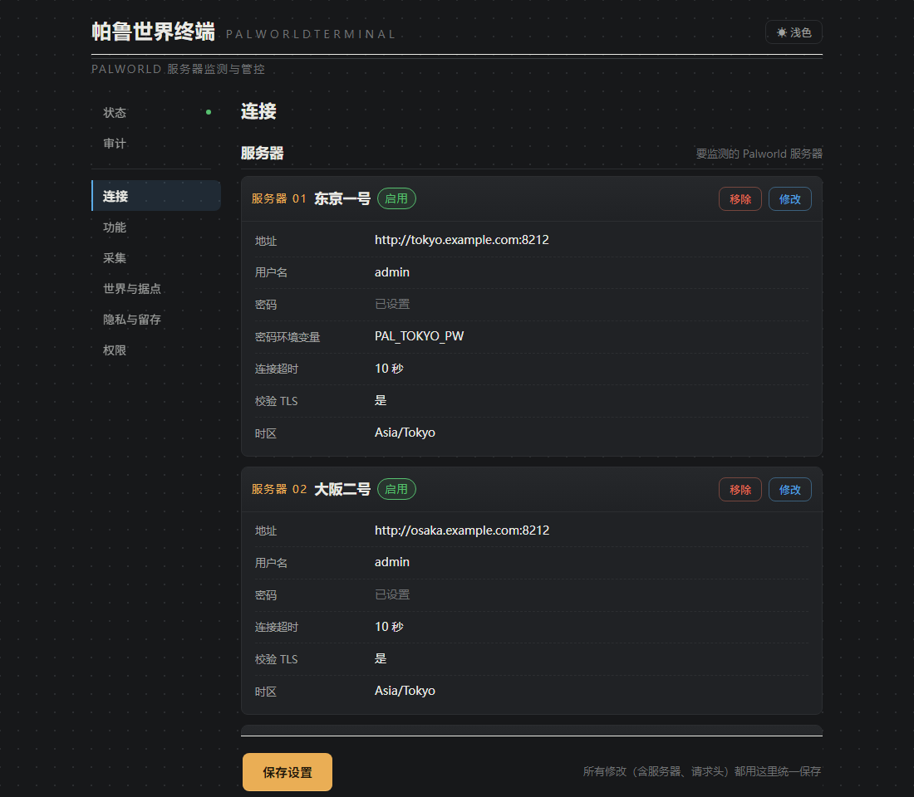
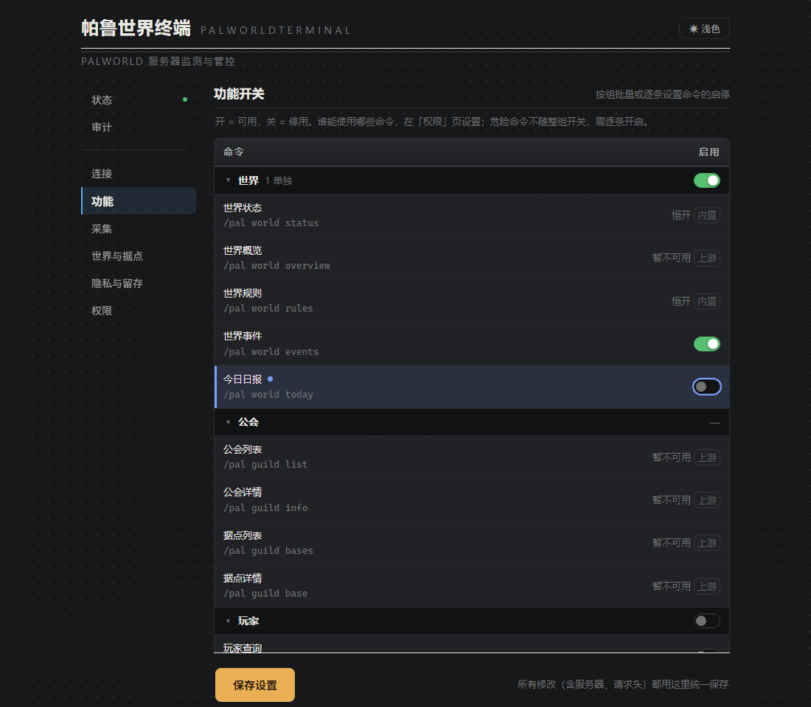
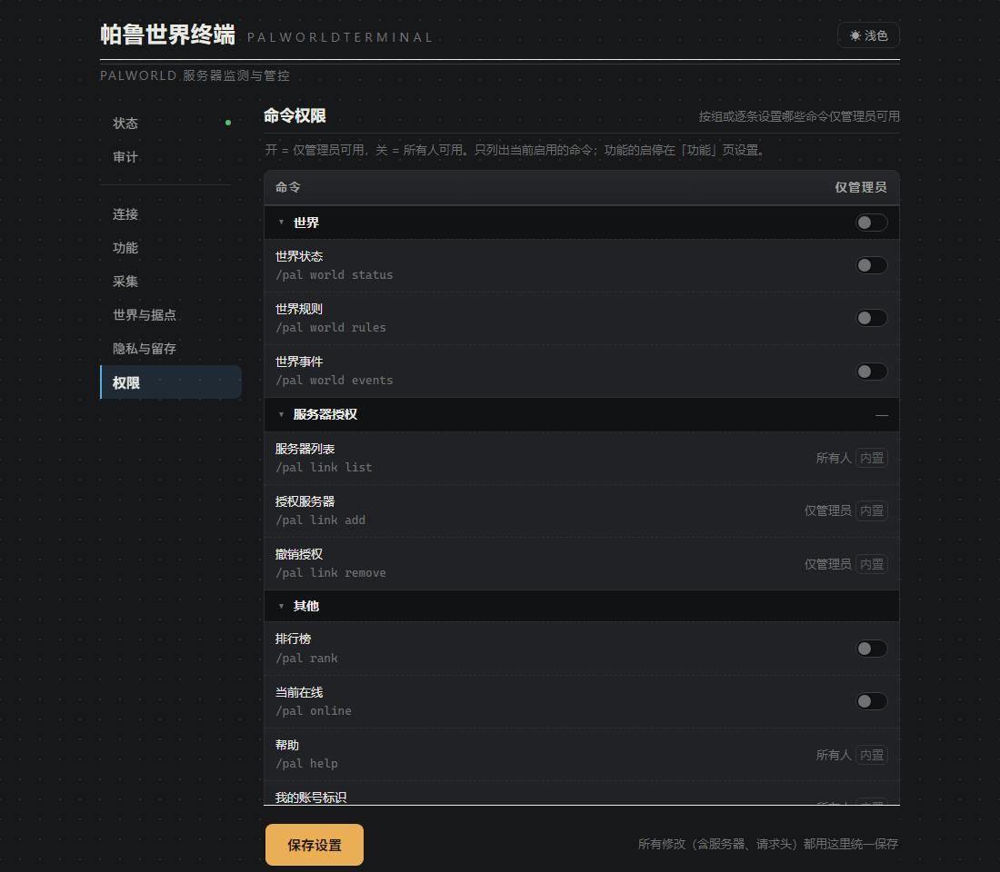
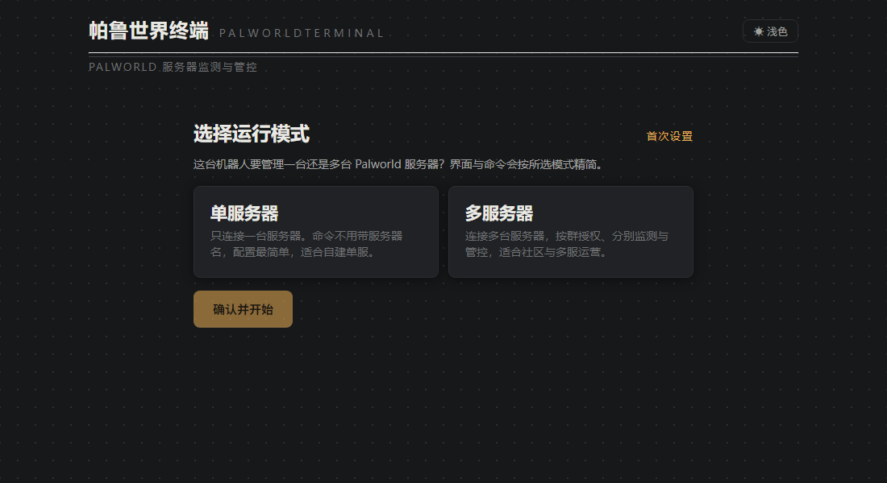

<div align="center">


# PalWorldTerminal · 帕鲁世界终端

[](https://plugins.astrbot.app/)
[](https://github.com/SolitudeRA/astrbot_plugin_palworld/blob/main/metadata.yaml)
[](https://github.com/SolitudeRA/astrbot_plugin_palworld/actions/workflows/ci.yml)<br>
[](https://github.com/AstrBotDevs/AstrBot)
[](https://docs.palworldgame.com/category/rest-api/)
[](https://github.com/SolitudeRA/astrbot_plugin_palworld/blob/main/LICENSE)

**在 AstrBot 中，让服主统一管理 Palworld 单服或多服，也让群友通过状态、日报、事件与排行参与服内日常。**

服主管理：可视化设置 · 功能与权限分开 · 多服按群授权 · 危险操作二次确认<br>
群聊参与：世界状态 · 今日日报 · 事件记录 · 在线时长 / 等级排行 · 玩家档案

[查看实际界面](#实际界面) · [快速开始](#快速开始) · [完整指令](https://github.com/SolitudeRA/astrbot_plugin_palworld/blob/main/docs/commands.md) · [问题反馈](https://github.com/SolitudeRA/astrbot_plugin_palworld/issues)

状态采集只读 · 受控写默认关闭 · 服务器管理命令仅授权管理员<br>
玩家观测库不存储 IP · 群聊不公开精确位置 —— 详见[安全与边界](#安全与边界)

</div>

---

## 实际界面

以下截图来自插件实际设置页，使用内置演示数据；服务器地址、账号和状态均为示例。

### 日常管理集中在一个设置页

服务器连接、运行快照、功能开关、采集频率、隐私留存、管理员、命令权限和管理记录，都集中在同一个设置页。密码可以通过环境变量提供，页面不会回显敏感值；保存时会先检查配置，成功后插件自动重新加载。

<p align="center">
  
</p>

### 功能是否开放，和谁能使用，分开设置

每条可配置命令都能分别设置“是否启用”和“是否仅限管理员”。可以先按命令组统一设置，再对个别命令单独调整；群聊中的服务器管理命令、`link add/remove` 与 `/pal confirm` 始终只允许插件管理员执行。封禁、倒计时关服和强制停服不会跟随服务器管控组一并开启，必须逐项启用。

**功能开关：决定哪些命令可用**

<p align="center">
  
</p>

**管理员权限：决定已开放的命令由谁使用**

<p align="center">
  
</p>

### 单服保持简单，多服按群管理

首次设置时选择单服或多服。单服模式会把需要服务器目标的命令固定指向首台就绪服务器，使用时无需选择目标；多服模式可以连接多台服务器，为不同群分配访问范围，查询时也可以在命令末尾用 `@服务器名` 明确选择服务器。以后切换模式时，向导会先列出影响，并允许迁移群授权；切换到单服时，还可以指定保留的服务器，并决定是否清理其余服务器数据。

<p align="center">
  
</p>

## 群聊中的实际效果

完成首次设置并授权群聊后，成员可以查询世界状态、服务器规则、在线玩家、今日日报和事件记录；玩家档案与排行榜是否开放，由服主自行决定。这些内容按需查询、不会主动刷屏，却能让世界进度、在线纪录与玩家成长自然成为群里的共同话题。`/pal help` 会根据当前模式、功能开关和使用者身份，只展示实际可用的命令。

```text
🌍 世界状态 · Palpagos
第 42 天 · v1.0.0 · 已运行 6天9时

在线 2/32 · 今日峰值 7
性能 🟢 流畅 · FPS 58 · 帧时间 17.2ms

在线玩家
· Neo Lv21
· Trinity Lv18
```

服主按需开启后，插件管理员可以在群聊中广播、存档、处理玩家或安排关服。这些命令默认关闭，启用后通过官方 REST API 执行；关服等危险操作还可以要求二次确认。

```text
> /pal server shutdown 60 服务器维护
⚠️ 待确认 · 关服（60 秒倒计时） · 主服务器
└ 30 秒内发送 /pal confirm 执行，逾期自动作废

> /pal confirm
✅ 已确认执行 · 关服（60 秒倒计时） · 主服务器
```

## 能力与默认状态

| 能力 | 默认 | 说明 |
|---|---:|---|
| 世界观测 | 开 | 世界状态、规则、在线名单与分级帮助；仍需完成首次设置和会话授权 |
| 日报与事件 | 开 | 日报按查询生成，事件在轮询采样时记录；均按需展示，不主动推送 |
| 玩家档案 | **关** | 玩家查询、绑定、排行榜和个人档案由服主按需开启 |
| 基础管控 | **关** | 广播、存档、踢人、解封；始终仅插件管理员可用 |
| 危险管控 | **关** | 封禁、倒计时关服、强制停服必须逐条开启；可选二次确认 |
| 公会与据点 | **不可用** | 当前被插件硬锁，配置无法绕过 |

> **公会与据点暂不可用**：Palworld 1.0 [官方文档](https://docs.palworldgame.com/api/rest-api/game-data/)已经列出 `/game-data`，但当前专用服务器仍返回 `404 PalGameDataBridge GameData API is not enabled`，[官方配置表](https://docs.palworldgame.com/settings-and-operation/configuration/)也没有提供启用方式。因此 v1.0.0 暂时关闭相关命令和派生功能；这不是权限或插件配置问题，需要等待服务端开放并由插件适配后才能使用。

## 快速开始

### 环境要求

| 项目 | 要求 |
|---|---|
| AstrBot | **≥ 4.24.1 且 < 5** |
| Python | **≥ 3.11**；CI 覆盖 3.11、3.12、3.13 |
| Palworld | 适配专用服务器 1.0 REST API；正式使用前请在自己的部署环境中确认 REST 连接 |
| 数据目录 | AstrBot 数据目录可写且已持久化；无需单独部署数据库服务 |

### 1. 启用 Palworld REST API

打开实际生效的 `Pal/Saved/Config/WindowsServer/PalWorldSettings.ini` 或 `LinuxServer/PalWorldSettings.ini`，设置高强度的 `AdminPassword`、`RESTAPIEnabled=True` 和 REST 端口（默认 `8212`），保存后重启 PalServer。`DefaultPalWorldSettings.ini` 只是模板，修改它不会生效。

在运行 AstrBot 的主机或容器中执行以下命令，确认能够访问服务器：

```bash
curl -u admin http://PALWORLD_HOST:8212/v1/api/info
```

输入 `AdminPassword` 后应返回服务器信息。`8212/TCP` 是 REST 端口，不是游戏端口 `8211/UDP`。请勿把 REST API 直接暴露到公网，应放在可信局域网、私有容器网络、VPN 或受保护的反向代理之后。

### 2. 安装插件

在 AstrBot WebUI 打开插件市场，搜索 `PalWorldTerminal` 并安装。也可以使用 WebUI 的 URL 或本地文件入口安装；所需依赖通常由 AstrBot 自动处理。

### 3. 选择模式并添加服务器

打开「PalWorldTerminal 设置」，选择单服或多服，然后填写 AstrBot 能够访问的 `base_url`、用户名和 Palworld `AdminPassword`，不要误用 `ServerPassword`。地址只写到端口，不要附加 `/v1/api`。模式确认前，除 `/pal help`、`/pal whoami`、`/pal whereami` 外，其他命令都会被首次设置闸拦截。

生产环境推荐使用 `password_env` 引用注入 AstrBot 进程或容器的环境变量；变量变更后需要重启整个 AstrBot 进程。

> 如果 AstrBot 运行在 Docker 中，`127.0.0.1` 指向 AstrBot 容器本身，而不是 PalServer。跨容器连接时，请使用同一私有网络中的服务名、宿主机网关或局域网地址；时区应按服务器所在地设置，中国大陆服务器通常应将默认的 `Asia/Tokyo` 改为 `Asia/Shanghai`。

### 4. 完成安全授权

新装默认使用“受限授权”（`access_mode=restricted`）：加入授权名单之前，群聊不能查询服务器。这是预期的安全状态，不是安装失败。

- **单服**：在目标群发送 `/pal whereami`，把返回的 UMO 加入「连接 → 授权群名单」。
- **多服**：发送 `/pal whoami`，把返回的 `平台:账号` 加入插件管理员名单，再在目标群执行 `/pal link add <服务器名>`。

插件管理员由本插件单独维护，不沿用 AstrBot 全局管理员。需要管理服务器时，还要在功能页逐项开启相应命令。

### 5. 验证

先确认设置页已经显示服务器运行快照，再到授权群聊中执行：

```text
/pal world status
/pal online
```

公会与据点受当前服务端能力限制，不纳入首次验收。

## 常用指令

| 指令 | 默认 | 用途 |
|---|---:|---|
| `/pal help` | 开 | 按当前模式、功能开关和身份生成分级帮助 |
| `/pal world status` | 开 | 世界状态、在线人数、FPS 与世界天数 |
| `/pal online` | 开 | 当前在线玩家名单 |
| `/pal world today` | 开 | 按需生成今日日报与在线统计 |
| `/pal world events` | 开 | 世界天数里程碑、在线纪录、新玩家与升级事件 |
| `/pal rank [today\|total\|level]` | 关 | 今日/当前已存历史在线时长榜与等级榜 |
| `/pal me [hide\|show]` | 关 | 个人档案及自助隐藏 |
| `/pal server ...` | 关 | 广播、存档、玩家处置与停服管控 |

多服模式使用 `/pal link list/add/remove` 管理本群服务器授权；查询命令可在末尾添加 `@<服务器名>`，例如 `/pal world status @alpha`。管控命令使用本群当前活动服务器，切换目标后再执行。完整参数、关闭行为和权限矩阵见[完整指令文档](https://github.com/SolitudeRA/astrbot_plugin_palworld/blob/main/docs/commands.md)。

## 安全与边界

- **启用 REST，但勿暴露公网**：Palworld REST API 使用 Basic Auth，不应直接暴露到公网。优先使用私网、VPN 或受保护的网关。
- **受控写与审计**：所有服务器管理命令默认关闭，并始终要求插件管理员身份。审计存储正常时，实际发送到服务器的管理请求会记录成功或失败；在权限、参数或服务器选择阶段被拒绝的请求不会写入审计。
- **敏感凭证优先使用环境变量**：使用 `password_env` / `value_env` 时，敏感值不会写入插件配置，也不会在设置页回显。直接填写的密码或 Header 值仍会进入 AstrBot 配置文件和备份。
- **尽量少保存玩家数据**：观测库不保存玩家连接 IP、原始 `userId/playerId`、账号名或原始 Ping；玩家标识使用世界级 HMAC。当前不采集 `/game-data` 派生位置，群聊回复也不会显示精确坐标。
- **停服前先保存**：`server stop` 会直接停止服务器，不会先保存世界。重要操作前请先执行 `/pal server save`，并建议为危险命令开启二次确认。
- **留存设置尚未自动执行**：历史和审计数据已有保留天数设置，但当前版本尚未自动执行到期清理。请按照自己的运营与合规要求管理 AstrBot 数据目录，不要把这些设置视为自动删除保证。

更多服务器连接、群聊授权、轮询、凭证、隐私和模式转换说明，见[配置文档](https://github.com/SolitudeRA/astrbot_plugin_palworld/blob/main/docs/configuration.md)。

## 常见问题

| 现象 | 优先检查 |
|---|---|
| “尚未完成首次设置” | 打开插件设置页，选择单服或多服并确认 |
| “未授权” | 单服检查授权群名单；多服检查插件管理员名单与 `/pal link add` |
| `401 Unauthorized` | 是否把 `ServerPassword` 误当成 `AdminPassword`，或环境变量没有注入 AstrBot 进程 |
| 超时 / 拒绝连接 | REST 是否启用并重启、`8212/TCP`、防火墙、容器网络及 `base_url` |
| “无可用服务器” | 服务器是否启用、地址与密码是否完整；配置就绪不代表网络一定在线 |
| 公会 / 据点不可用 | 当前专用服务器 `/game-data` 的运行时限制，不是权限配置错误 |

## 文档与贡献

- [配置项详解](https://github.com/SolitudeRA/astrbot_plugin_palworld/blob/main/docs/configuration.md) —— 服务器、路由、权限、轮询、隐私、凭证与设置页
- [完整指令文档](https://github.com/SolitudeRA/astrbot_plugin_palworld/blob/main/docs/commands.md) —— 命令树、参数、默认状态、路由与降级行为
- [贡献指南](https://github.com/SolitudeRA/astrbot_plugin_palworld/blob/main/CONTRIBUTING.md) —— 开发环境、测试、前端构建与提交约定
- [问题反馈](https://github.com/SolitudeRA/astrbot_plugin_palworld/issues) —— 请附版本、运行模式和脱敏日志；不要提交密码、Token 或完整用户标识

CI 会执行 Ruff、mypy、Python 测试矩阵，以及前端测试与构建检查。运行时依赖仅有 `aiohttp`、`aiosqlite`、`tzdata`；开发环境使用 `requirements-dev.txt`，最终用户不需要 Node/npm。

## 开源协议

本项目采用 [GPL-3.0](https://github.com/SolitudeRA/astrbot_plugin_palworld/blob/main/LICENSE) 许可。
